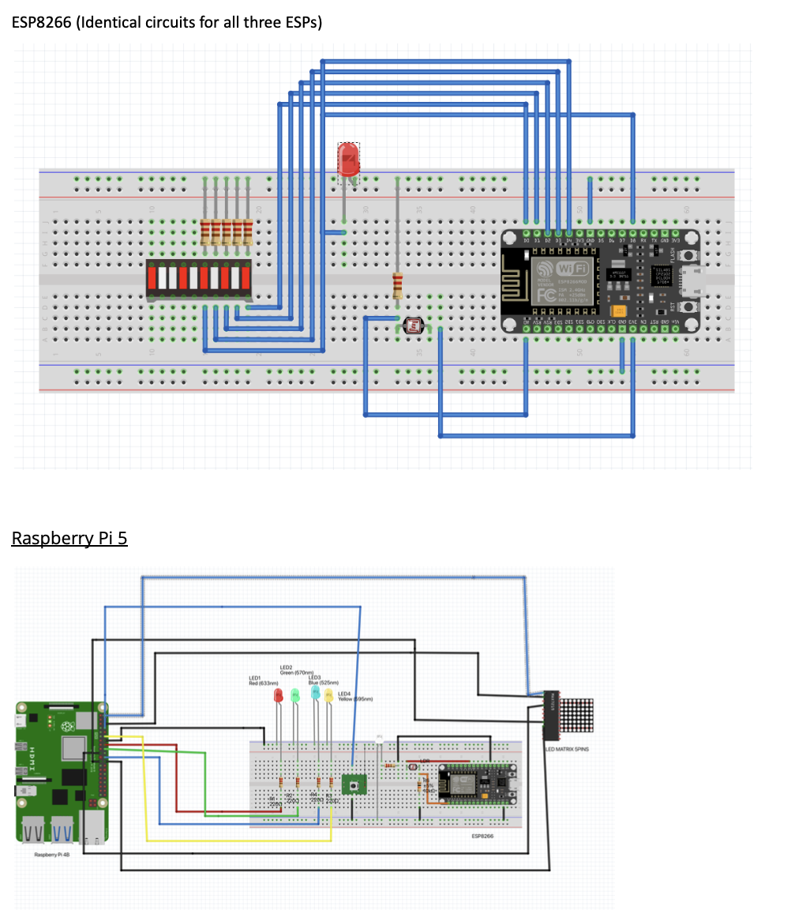
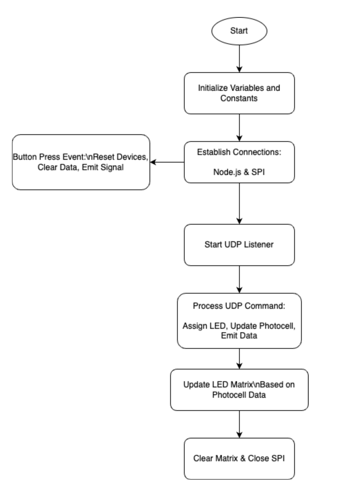
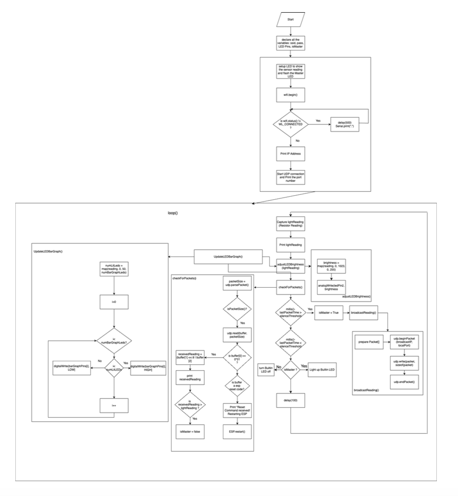

# ESP8266 Light Intensity and Visualization System

## Objective
This project builds upon Assignment 4 and integrates multiple components for light intensity measurement, role determination, and real-time visualization. It involves the communication of three ESP8266 devices, a Raspberry Pi for data processing and visualization, and a Node.js web interface to monitor data.

---

### **ESP8266 Device Capabilities:**

- **Wi-Fi and UDP Communication:**
  - The ESP8266 devices connect to the Wi-Fi network and use UDP communication to exchange data with other devices in the network.

- **Light Intensity Measurement:**
  - Each ESP8266 continuously measures the light intensity using a photocell sensor. The device adjusts the brightness of an external LED according to the measured light level.

- **LED Bar Graph:**
  - One of the ESP8266 devices has an LED bar graph to visually represent the light intensity. The number of LEDs lit on the bar graph corresponds to the level of light detected.

- **Master-Slave Role Determination:**
  - The devices communicate with each other to determine which one has the highest light intensity. The device with the highest reading is assigned the "Master" role, while others are designated as "Slaves."
  - If another device sends a higher light reading, the roles are updated dynamically.

- **Broadcasting Readings:**
  - Each ESP8266 device broadcasts its light reading over UDP unless it detects that another device has sent a higher reading within a defined silence threshold.

- **UDP Packet Handling:**
  - The ESP8266 devices check for incoming UDP packets, update their role based on received data, and adjust the LEDs accordingly.

---

### **Raspberry Pi Visualization and Control:**

- **Photocell Data Visualization:**
  - The Raspberry Pi receives the light intensity data from the ESP8266 devices. It displays this data on an LED Matrix as a 30-second moving trace, showing the fluctuations in light levels over time.

- **Data Logging:**
  - The Raspberry Pi logs all received data along with timestamps to track the light intensity changes. The logs are used for analysis and visualization purposes.

- **System Control:**
  - The Raspberry Pi provides a button to reset the devices. Pressing this button initiates a system-wide reset of the ESP8266 devices, allowing the roles and readings to be recalculated.

- **Static Visualizations:**
  - In addition to the real-time LED Matrix display, the Raspberry Pi can serve static visualizations through a Node-RED web server, which displays data in graphical formats like charts.

---

### **System Demonstration and Logging:**

- **Master Transitions and Data Forwarding:**
  - The system should smoothly transition the "Master" role between devices based on light intensity changes. The devices forward their data to the Raspberry Pi in real time, ensuring proper synchronization across the network.

- **Log Entries:**
  - Logs capture essential information, including the device roles (Master/Slave), raw sensor readings, and timestamps for each event. This helps in tracing system behavior and analyzing data trends.

### **LED Matrix (MAX7219) Visualization:**

- **Data Representation on LED Matrix:**
  - The Raspberry Pi uses the MAX7219 chip to control an 8x8 LED matrix that visually represents the averaged photocell readings. As the light intensity fluctuates, the corresponding rows or columns on the LED matrix are lit up to show the data.

- **Real-Time Update:**
  - The system updates the LED matrix in real time as the light readings change, providing a clear visual representation of the sensor data over time.

---

### **Schematics:**

---

### **Node.js Integration:**

- **Real-Time Data Sync:**
  - A Node.js server is set up to receive real-time data from the Raspberry Pi. Using Socket.IO, it facilitates two-way communication, ensuring that data from the Raspberry Pi is transmitted to the client-side for visualization and interaction.

- **Web Interface:**
  - A web-based interface displays live updates of the photocell data and the active time of the "Master" device in the network. The frontend is built with HTML, and real-time graphs are generated using Chart.js.

---

### **Code Flowchart:**

**RaspberryPi:**

**ESP8266:**

---

### Results on :**

